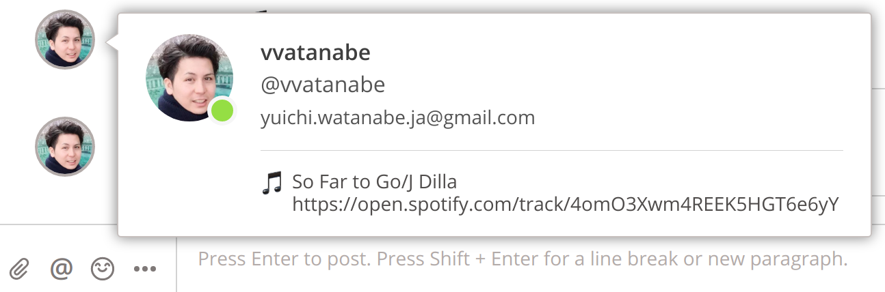
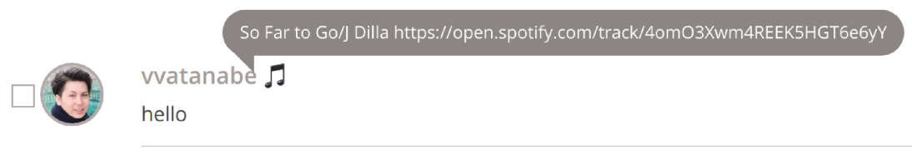
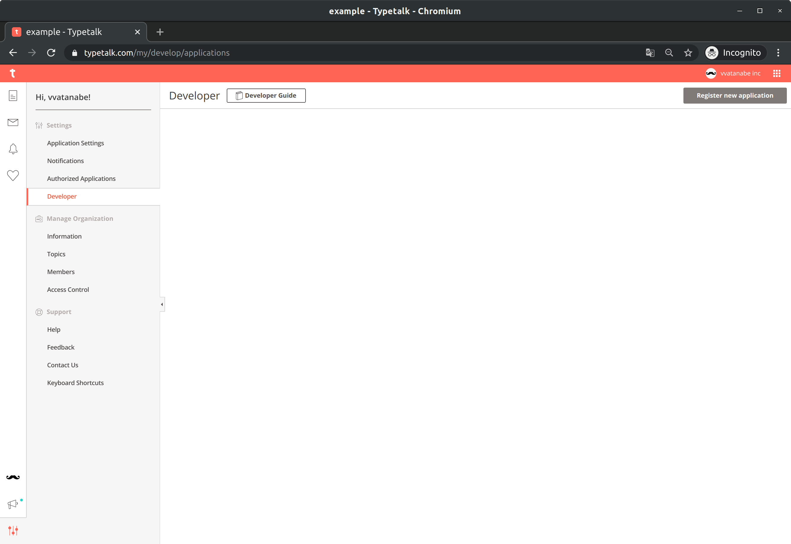
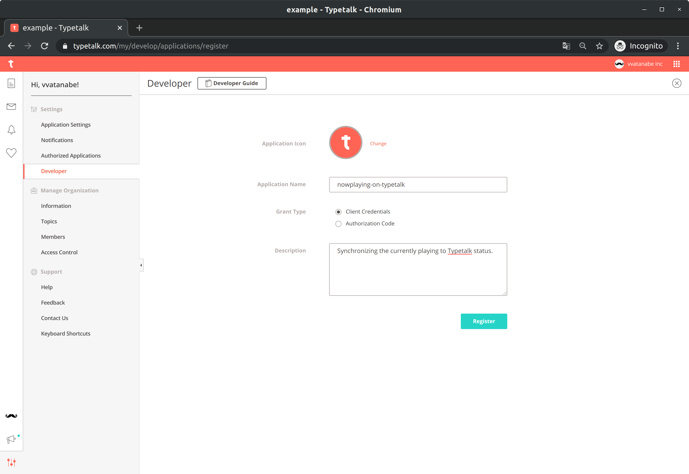
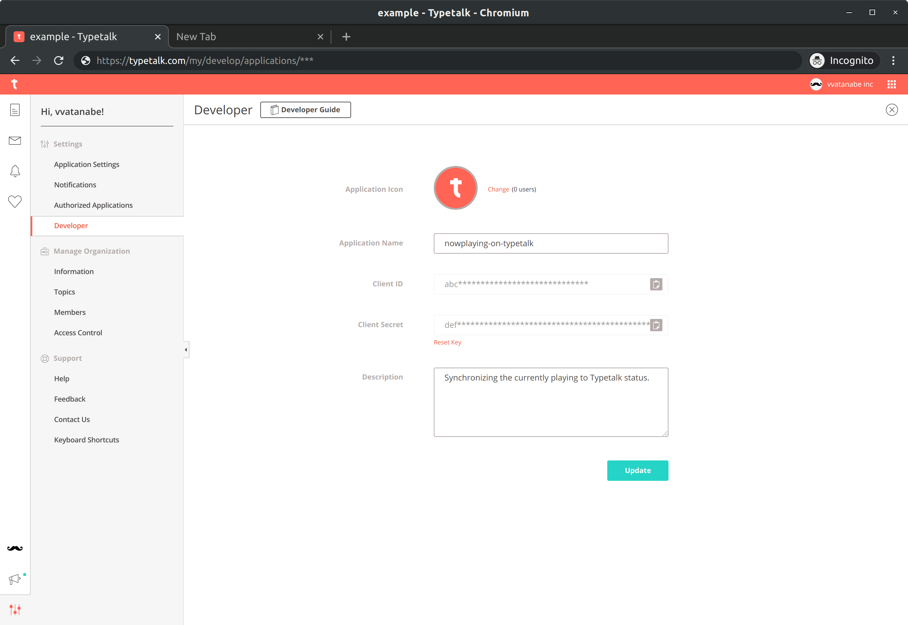
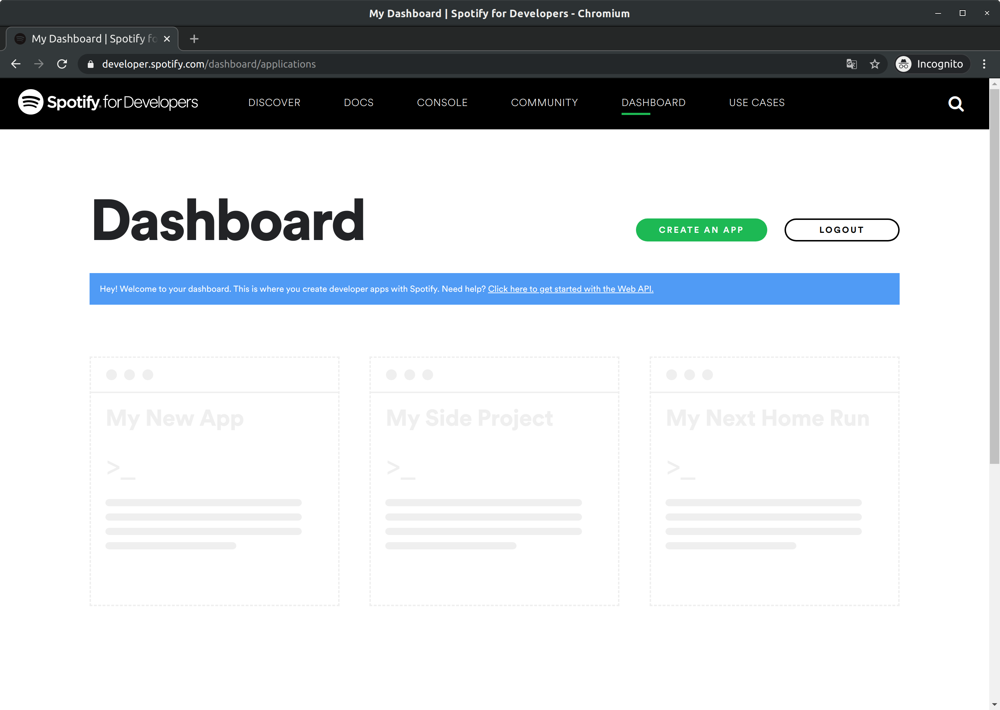
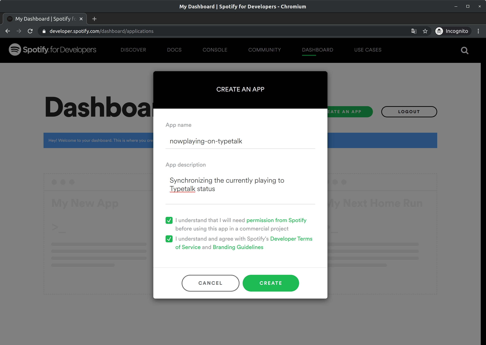
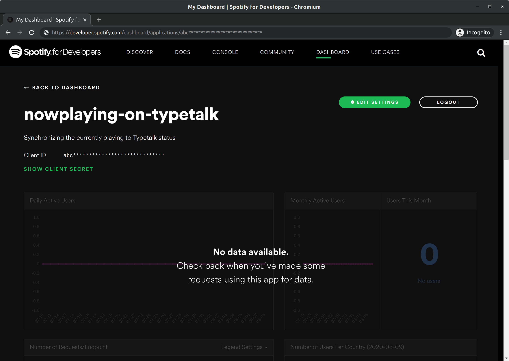
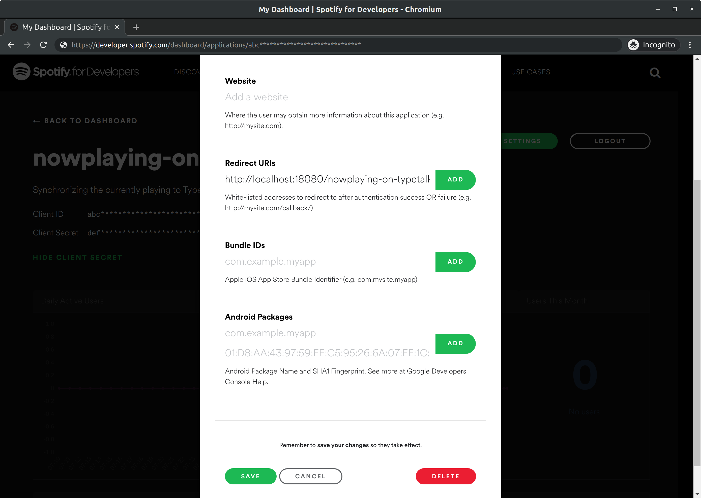
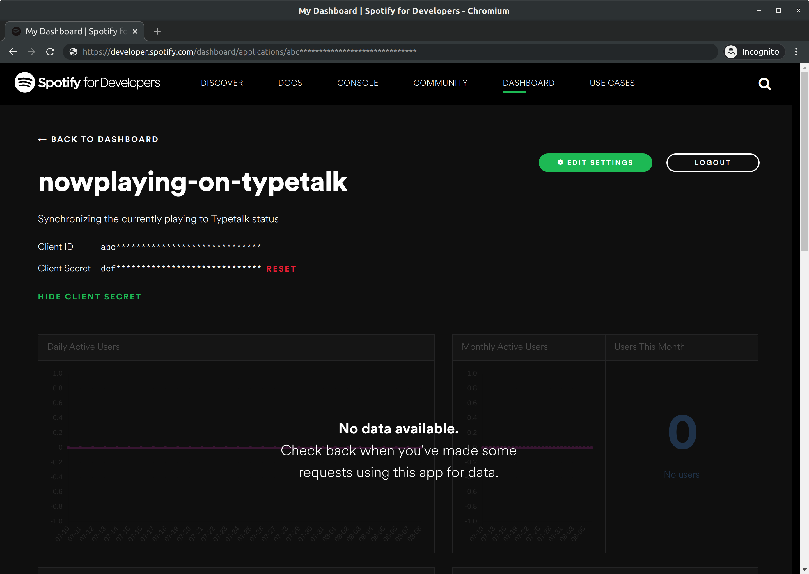

# nowplaying-on-typetalk 

A command line tool to display the song currently playing on Spotify in Typetalk status.





## Motivation

We want to share the track we are listening to at work in a discreet and easy way.
If we post to a topic in Typetalk, we have to open that topic and that post is noise.
If it's a status, we can just hover over any topic, and it's not noise.

## Getting Started

1. [Install the nowplaying-on-typetalk.](#installation)
2. [Register Typetalk App and get Client ID and Client Secret.](#setting-typetalk-app)
3. [Create Spotify App and set the URL to redirect to after authentication, get Client ID and Client Secret.](#setting-spotify-app)
4. [Write a config file.](#config-file)
5. [Execute the nowplaying-on-typetalk command.](#Synopsis)
    - When you execute this command, your browser will launch.
    - You can see Spotify's authentication screen in your browser.
    - Authenticate with your Spotify account.

## Installation

### GoBinaries

You can easily install it by making a curl request to [gobinaries.com](http://gobinaries.com/). You don't have to install Go.

```sh
$ curl -sf https://gobinaries.com/typetalk-gadget/nowplaying-on-typetalk | sh
```

### Homebrew

It can be installed with Homebrew, the package manager for MacOS.

```sh
$ brew tap typetalk-gadget/nowplaying-on-typetalk
$ brew install nowplaying-on-typetalk
```

### Go

If you have the Go(go1.14+) installed, you can also install it with go get command.

```sh
$ go get github.com/typetalk-gadget/nowplaying-on-typetalk
```

If the installation fails, set the environment variable `GO111MODULE` to `on` by the following command.

```
# Bash
$ export GO111MODULE=on
```
```
# Windows Command Prompt
> set GO111MODULE=on
```

### GitHub Release Page

Built binaries are available on Github releases:  
https://github.com/typetalk-gadget/nowplaying-on-typetalk/releases

## Synopsis

```
$ nowplaying-on-typetalk [flags]
```

## Flags

```
  -c, --config string                   config file path (default "~/.nowplaying-on-typetalk/config.yml". if you set $XDG_CONFIG_HOME, switch default to "$XDG_CONFIG_HOME/nowplaying-on-typetalk/config.yml")
      --debug                           debug mode
  -h, --help                            help for nowplaying-on-typetalk
      --port int                        port number for OAuth (default 18080)
      --spotify_client_id string        spotify client id [SPOTIFY_CLIENT_ID]
      --spotify_client_secret string    spotify client secret [SPOTIFY_CLIENT_SECRET]
      --status_emoji string             typetalk status emoji [STATUS_EMOJI] (default ":musical_note:")
      --typetalk_client_id string       typetalk client id [TYPETALK_CLIENT_ID]
      --typetalk_client_secret string   typetalk client secret [TYPETALK_CLIENT_SECRET]
      --typetalk_space_key string       typetalk space key [TYPETALK_SPACE_KEY]
  -v, --version                         version for nowplaying-on-typetalk
```

## Config File

### Default Config File

Default par is `~/.nowplaying-on-typetalk/config.yml`.

Default config file extension can be either `.yml` or `.yaml`.

### XDG Base Directory

If you set `$XDG_CONFIG_HOME`, switch default to `$XDG_CONFIG_HOME/nowplaying-on-typetalk/config.yml`.

### YAML Structure

```yaml
debug: true
port: 18080
typetalk_client_id: deadbeef
typetalk_client_id: deadbeef
typetalk_client_secret: deadcode
typetalk_space_key: foo
spotify_client_id: deadbeef
spotify_client_secret: deadcode
status_emoji: ":musical_note:"
```

## Setting Typetalk App

This tool uses Typetalk's API to save the currently status. So you need to create a Typetalk App and get Client ID and Client Secret.

This section explains how to setting Typetalk App.

### 1. Login to your develop setting in Typetalk

- Login to Typetalk and open develop setting from following URL.
  - https://typetalk.com/my/develop/applications

### 2. Register new app

- Once you have successfully logged in, your develop setting will open.
- Click "Register new application" and register a new Typetalk App.



- Fill in the "Application Name" and "Grant Type" and "Description" fields on the APP register form.
  - Application Name: nowplaying-on-typetalk
  - Grant Type: Client Credentials
  - Description:  Synchronizing the currently playing to Typetalk status
- Click the "Register" and open the App management screen.



### 3. Get Client ID and Client Secret

- You can see the "Client ID" and "Client Secret" of this app.



## Setting Spotify App

This tool uses Spotify's API to get the currently playing song. So you need to create a Spotify App and get Client ID and Client Secret. You also need to set up a URL to be redirected to after authentication.

This section explains how to setting Spotify App.

### 1. Login to your dashboard in Spotify

- The following URL will open the login screen to Spotify's dash-board.
  - https://developer.spotify.com/dashboard/login
- Click "LOG IN" and login with your account.


### 2. Create new app

- Once you have successfully logged in, your dashboard will open.
- Click "CREATE NEW APP" and create a new Spotify App.



- Fill in the "App name" and "App description" fields on the APP creation form.
  - App name: nowplaying-on-typetalk
  - App description:  Synchronizing the currently playing to Typetalk status
- Check the checkbox to agree to the terms.
- Click the "CREATE" and open the App management screen.



### 3. Set the URL to redirect to after authentication

- The following shows the App administration screen.
- Click the "EDIT SETTING" and open the App Settings Editor screen.



- Set the following URL in "Redirect URI's" as the URL to be redirected to after authentication.
  - http://localhost:18080/nowplaying-on-typetalk (* The port number should be as same as your config. )
- Click the "ADD" and Click the "SAVE" and save the setting.



### 4. Get Client ID and Client Secret

- You can check the "Client ID" and "Client Secret" on the administration screen of the app.
- Click the "SHOW CLIENT SECRET" and display the "Client Secret".



## Bugs and Feedback

For bugs, questions and discussions please use the GitHub Issues.

